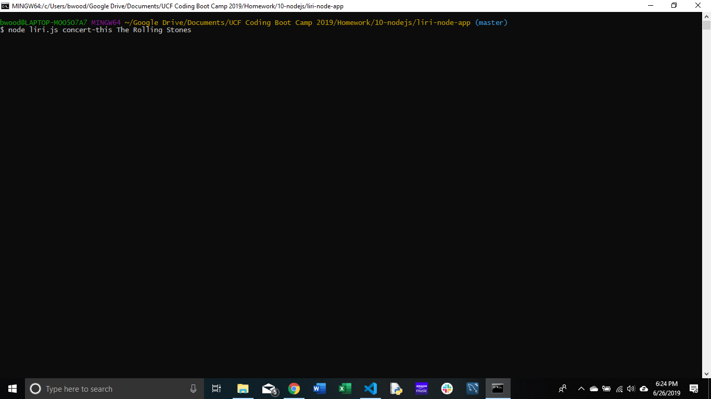
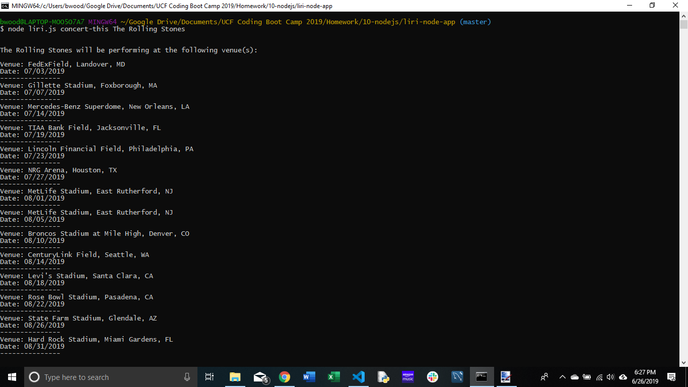
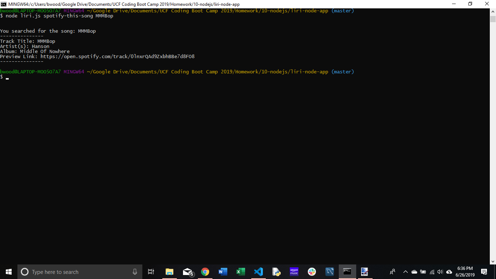
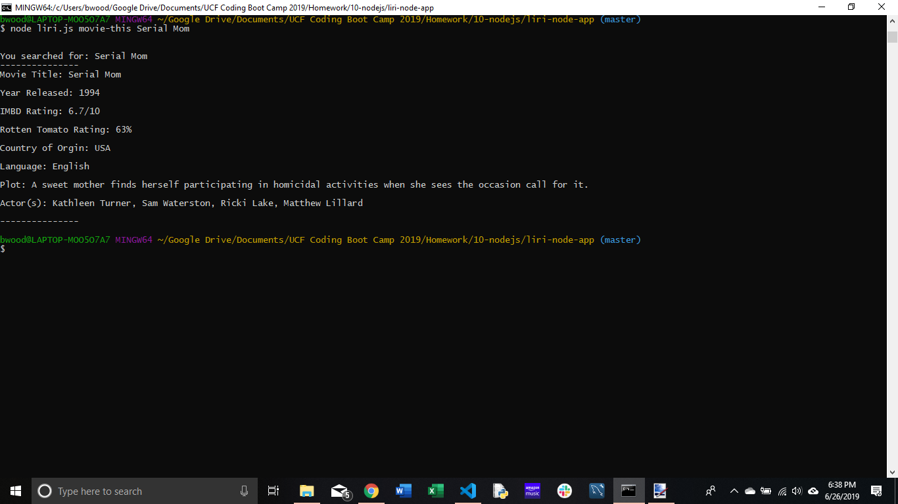
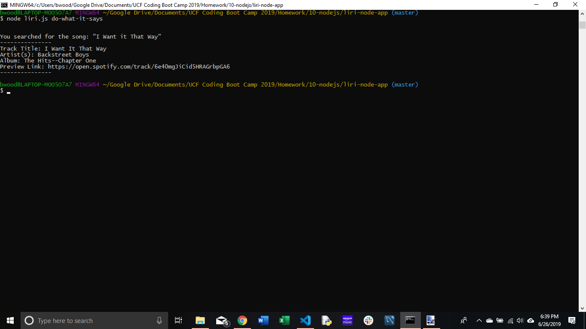

# liri-node-app

This is the LIRI bot homework assignment for UCF Coding Bootcamp 10-node.js homework.

## Purpose

This app takes data from the user, a command and a search term and then runs an API requst returning information about the search term.

## Instructions

In the terminal run the command "node liri.js" followed by the search command and the search term.  Your command should look like this:

```
    $ node liri.js <search-command> <search-term>
```

The available search commands are:

```
    concert-this
    spotify-this-song
    movie-this
    do-what-it-says
```

**concert-this**

The `concert-this` function requires a search term. The search term can be a single word or multiple words.  Example:
```
    $ node liri.js concert-this The Rolling Stones
```

**spotify-this-song**

The `spotify-this-song` function requires a search term. The search term can be a single word or multiple words. Example:
```
    $ node liri.js spotify-this-song MMMBop
```

**movie-this**

The `movie-this` function requires a search term. The search term can be a single word or multiple words. Example:
```
    $ node liri.js movie-this Serial Mom
```

**do-what-it-says**

The `do-what-it-says` function does not require a search term. This search function reads the `random.txt` file and then takes a search command and search term from it.  Any search term in the terminal window will be ignored.  Example:
```
 $ node liri.js do-what-it-says
```
## Screenshots






## Link to project

This project is deployed to github: https://github.com/BrianChristopher/liri-node-app.git

## Technologies Used

This project was created with Javascript and run in node.js.  Several node packages were used:

* axios

    Axios was used to access the OMDB/IMDB and Band In Town APIs.

* node-spotify-api

    This was used to access the Spotify API.

* dotenv

    Dotenv allowed for hiding API keys and other sensitive data that should not be made public in github.

* moment

    Moment.js was used to convert event times received from the Bands In Town API.


